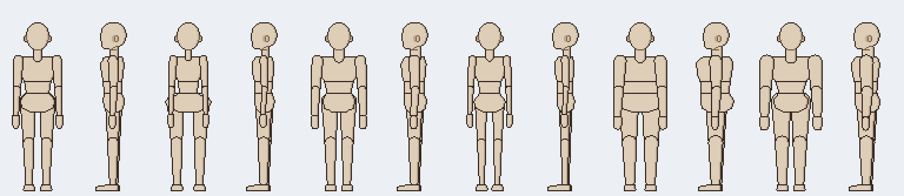
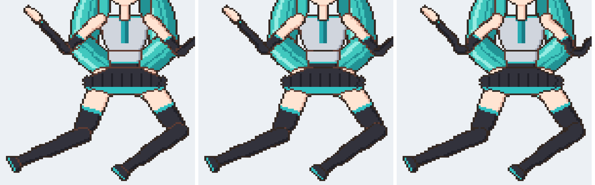
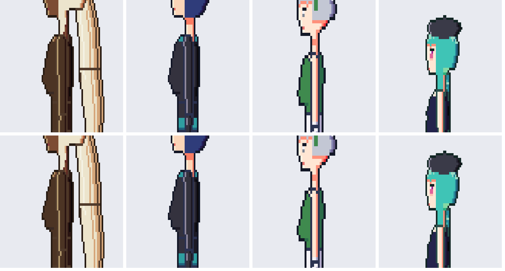
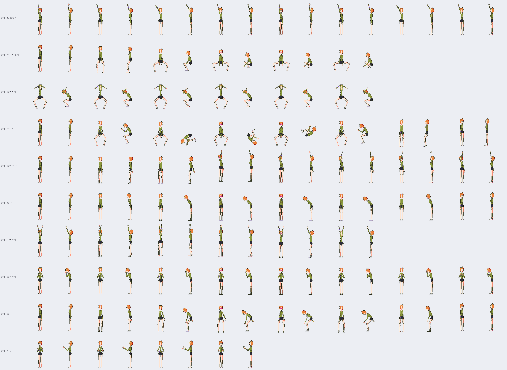
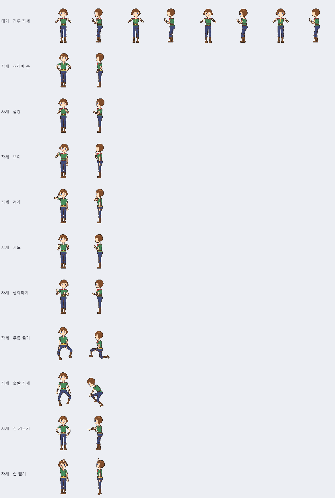
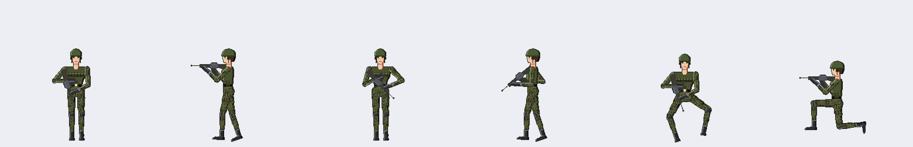
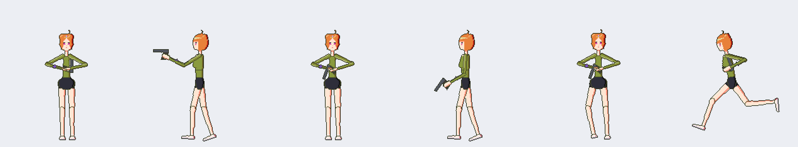

# 패치노트 — 체형, 뼈대 편집, 관절 부드럽게, 동작 57종, 총

날짜: 2026-09-27 · 브랜치: `feature/body-shapes`

> 이번 묶음의 그림은 앱 화면 캡처가 아니라, 같은 Core 코드로 렌더링한 결과입니다. 새 버튼과 메뉴(체형 선택, 뼈대 편집, 관절 부드럽게, 기본 동작 가져오기, 총 추가·자세 맞추기)는 빌드와 테스트로만 확인했고, 앱 화면에서 직접 누르며 확인하지는 않았습니다.

## 1. 체형 선택

새로 만들기에서 **등신 → 체형** 순서로 고릅니다. 체형은 기본·여성형·남성형·마른형·통통형·근육형 6가지입니다. 어깨·허리·골반·가슴 두께·팔다리·목 굵기에 계수를 곱하고, 길이는 그대로 둡니다. 그래서 기본 동작도 그대로 맞습니다. 기본 체형의 결과는 이전과 픽셀까지 같습니다. 4등신에서 기본이 아닌 체형을 고르면 손으로 그린 템플릿 대신 생성한 마네킹을 씁니다.

`BodyProportions.For(heads, headPixels, shape, factors)`로 계수를 직접 넘길 수도 있고, 머리 폭 계수(`Head`)도 있습니다.

6등신: 기본·여성형·남성형·마른형·통통형·근육형 (정면·옆)

## 2. 뼈대 편집 (J)

포즈 모드의 하위 모드입니다. 도구 창의 **뼈대 편집** 체크와 보기 메뉴에 있습니다.

- 파츠를 끌면 **아래 파츠와 함께 옮겨집니다**(상완 → 전완·손).
- **관절 점**을 끌면 그림은 두고 회전 중심만 옮겨집니다.
- **좌우 짝도 함께**(기본 켬): 정면·후면에서는 몸 중심선을 기준으로 반대쪽이 거울처럼, 옆·반측면에서는 같은 방향으로 옮겨집니다.
- 돌려 놓은 포즈에서도 파츠가 마우스를 따라오고, 쉬는 자세를 기준으로 저장됩니다.
- Alt를 누르면 고른 파츠, Shift를 누르면 가로·세로로만 옮깁니다. 끌기 한 번이 되돌리기 한 번입니다.

## 3. 관절 부드럽게

도구 창의 **관절 부드럽게** 체크와 **반경**(기본 6px) 설정입니다. 굽힌 관절에서 부모와 자식이 관절 둘레에 걸쳐 휘어지며 **중간 각도로 만납니다**. 위치만 lerp하고 색은 섞지 않습니다.

- 부모 쪽도 휘는 것은 자식이 하나뿐인 파츠(팔·다리·꼬리 마디)만입니다.
- 남는 틈은 가까운 파츠의 색으로 채우고, 관절에서는 이음새 선을 긋지 않습니다.
- 미리보기·애니메이션·내보내기에 반영되고 프로젝트에 저장됩니다(켰을 때만 기록). 기본은 꺼져 있습니다.

왼쪽부터 기존 · 반경 4 · 반경 8

## 4. 가슴 볼륨: 옆모습은 물방울 모양

옆모습에서는 쇄골에서 가슴선이 수직으로 내려오다가(28% 지점까지), 부드럽게 나와 아래쪽(74%)에서 가장 불룩하고 밑은 둥급니다. 정면 모양은 그대로입니다. 위가 이전, 아래가 새 모양입니다.

## 5. 동작 57종 추가 (기본 6종은 그대로)

| 분류 | 동작 |
| --- | --- |
| 대기 | 숨쉬기, 두리번, 짝다리, 전투 자세, 졸음 |
| 걷기 | 경쾌하게, 조심조심, 모델 워킹, 지친 |
| 달리기 | 전력질주, 조깅, 소녀풍 |
| 점프 | 제자리, 큰 점프, 2단 점프 |
| 공격 | 내려베기, 찌르기, 가로베기, 주먹 연타, 발차기, 마법 시전, 활쏘기 |
| 피격 | 크게 밀림, 쓰러짐, 막기 |
| 동작 | 손 흔들기, 쪼그려 앉기, 웅크리기, 구르기, 승리 포즈, 인사, 기뻐하기, 슬퍼하기, 줍기, 박수 |
| 자세 (1프레임) | 허리에 손, 팔짱, 브이, 경례, 기도, 생각하기, 무릎 꿇기, 출발 자세, 검 겨누기, 손 뻗기 |
| 소총 | 대기, 조준, 사격, 걷기, 조준하며 걷기, 달리기, 앉아 쏴, 재장전 |
| 권총 | 대기, 조준, 사격, 달리기 |

- 동작은 "팔 앞으로, 무릎 굽힘, 몸 숙임"처럼 의미 단위로 적어 정면·옆·뒤 값으로 바꿨고, 반측면은 앱의 자동 초안으로 만들었습니다.
- 정면에서는 다리를 원근으로 줄일 수 없습니다. 그래서 깊이 앉을 때는 무릎을 벌리고 몸을 그만큼만 내립니다. 반측면도 정면보다 더 내리지 않습니다.
- 4~8등신 생성 마네킹과 손으로 그린 4등신 템플릿 모두에서 캔버스 끝에 닿는 프레임이 없습니다. 쓰러짐은 눕는 대신 무릎을 꿇으며 쓰러지는 동작입니다(누우면 캔버스 폭을 넘음).
- **새로 만들기**에는 전부 나오지만 기본 6개만 체크되어 있습니다.
- **파일 → 기본 동작 가져오기...**로 기존 프로젝트에도 넣을 수 있습니다. 이동 거리는 그 캐릭터의 키에 맞춥니다.

7등신: 동작 10종 (정면·옆, 모든 프레임)

자세 10종 (4등신)

## 6. 총과 총 잡는 자세

- 파츠 창에 **총 추가 [소총] [권총]**, **총 잡는 자세 맞추기**, **총 삭제**를 넣었습니다.
- 총은 손 R의 자식인 추가 파츠입니다. 가만히 있으면 총구가 아래를 향합니다.
- 그림에 **개머리판·총열 덮개·탄창** 위치가 장착점으로 들어 있습니다.
- 총을 추가하면 겨눈 총이 들어가도록 캔버스 좌우를 넓힙니다(되돌리기 한 번).
- 총기 동작은 총구 방향만 키에 적어 둡니다. 가져올 때와 버튼을 누를 때 **역운동학으로 팔을 그 몸에 맞춥니다**.
  - 소총: 개머리판은 오른쪽 어깨(총구를 높이 든 달리기는 오른쪽 허리), 오른손은 손잡이, 왼손은 총열 덮개. 재장전 중에는 왼손이 탄창을 잡습니다.
  - 권총: 두 손으로 손잡이를 쥐고, 옆에서는 조준 방향으로 뻗고 정면에서는 가슴 앞에 듭니다.
- 비스듬한 반측면에서는 총이 짧아 보여야 하므로 총구를 조금 낮춥니다.

군인 샘플: 조준 · 대기 · 앉아 쏴 (정면·옆)

권총: 조준 · 대기 · 달리기

## 7. 테스트

265개 모두 통과합니다. 추가한 테스트는 다음과 같습니다.
- 체형: 계수, 폭·길이, 관절, 캔버스
- 뼈대 편집: 이동·대칭·관절·회전 보정·되돌리기
- 관절 부드럽게: 틈·이음새·먼 픽셀 불변·저장
- 가슴 옆모습의 수직 구간과 물방울
- 총: 추가·되돌리기, 손잡이·총구, 그리는 순서, 수평 조준, 개머리판·왼손 위치, 권총 두 손

## 8. 알려진 제한

- 관절 부드럽게를 켠 상태에서 관절 근처에 그리면, 휘기 전 위치를 기준으로 그려집니다.
- 정면에서 총은 카메라 쪽을 겨눌 수 없어, 조준할 때 총구가 아래 중앙을 향합니다.
- 4등신은 팔이 짧아 팔짱·허리에 손 같은 자세가 대략적인 모양입니다.
