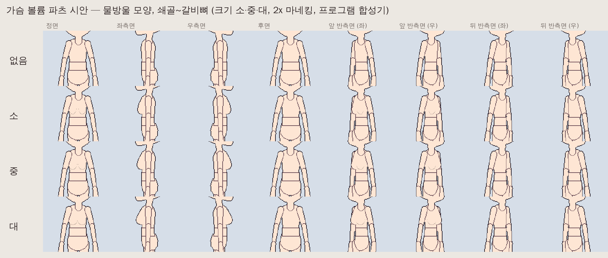

# 계획: 가슴 볼륨 파츠 (여성 캐릭터용 선택 파츠)

작성: 2026-09-25 · 상태: **구현됨** ([패치노트](patchnotes/2026-09-25-bust-part.md)) — 모양은 시작 그림이며, 이후 직접 다듬을 예정 · 관련: [눈 파츠](patchnotes/2026-09-25-eye-parts.md), [눈 위치](patchnotes/2026-09-25-eye-position.md), [설계 문서](design.md)

## 1. 목적

마네킹의 가슴 파츠는 남녀 공통의 평평한 몸통이다. 여성 캐릭터를 그릴 때 가슴의 볼륨을 **따로 켜고 끌 수 있는 선택 파츠**로 제공한다.

- 켜면 가슴 위에 볼륨 모양의 시작 그림이 생긴다. 크기는 소·중·대 중에서 고른다.
- 사용자는 그 위에 옷과 피부를 그려 다듬는다.
- 끄면 마네킹은 지금과 똑같다.

눈 파츠(`eye_r`·`eye_l`)와 같은 방식을 따른다. 부모 파츠의 **세부 파츠**로 붙어서 외곽선과 명암을 부모와 공유하고, 추가·삭제는 되돌리기가 된다.

## 2. 왜 따로 된 파츠인가

| 방식 | 장점 | 단점 |
| --- | --- | --- |
| 가슴 이미지에 직접 그리기 | 지금도 가능, 추가 기능 없음 | 몸통을 다시 그리면 같이 지워짐. 측면·반측면에서 **몸통 윤곽 밖으로 나오는 부분**을 그리려면 가슴 이미지 캔버스를 넓혀야 함. 켜고 끄기 불가 |
| **세부 파츠 (제안)** | 켜고 끄기·크기 선택. 방향마다 위치를 옮길 수 있음. 자체 레이어(피부/옷)를 가짐. 몸통 윤곽 밖으로 자연스럽게 나옴. 외곽선은 가슴과 합쳐 그려짐 | 파츠가 하나 늘어남 (파츠 목록·저장 파일) |

## 3. 파츠 구조

| 항목 | 값 |
| --- | --- |
| 이름 / 표시 이름 | `bust` / "가슴 볼륨" |
| 부모 | `chest` — 가슴이 돌면 같이 돈다 (걷기·공격 등 기존 동작 그대로 사용) |
| 세부 파츠 | 예 (`IsDetail`) — 외곽선·자동 명암에서 가슴과 한 덩어리. 가슴과 만나는 곳에 경계선이 생기지 않고, 바깥 윤곽만 합쳐서 그려짐 |
| 그리기 순서 | 방향마다 **가슴과 같은 순서 값**. 파츠 목록에서 가슴 바로 뒤에 넣어 가슴 다음에 그림. 머리·가까운 팔보다는 먼저 (측면에서 가까운 팔이 가림) |
| 저장하는 방향 | 정면·좌측면·후면, 반측면이 있으면 앞·뒤 반측면 (눈 파츠와 같음). 오른쪽을 향한 방향은 반전하며, "반전 끊고 따로 그리기"도 됨 |
| 관절 | 볼륨의 가운데. 방향마다 위치를 옮길 때(세부 파츠 위치) 기준점 |

## 4. 기본 모양 (시작 그림)

정면의 가슴 이미지에서 기준값을 잰다.

- 너비 **W**: 정면 가슴 이미지의 가로 폭
- 높이 **H**: 정면 가슴 이미지의 세로 길이
- 세로 범위: **쇄골**(가슴 이미지 위에서 0.10 H)부터 **아래 갈비뼈**(0.86 H, 허리선 바로 위)까지

**물방울 모양.** 쇄골에서는 가슴 벽과 붙어 있다가 아래로 갈수록 천천히 불어난다. 0.68 지점(위에서부터 범위의 68%)에서 가장 크고, 아래는 둥글게 닫힌다. 범위 안의 위치를 t(0 = 쇄골, 1 = 갈비뼈)라 할 때 굵기 비율은 다음과 같다.

- t < 0.68: (t / 0.68)^1.5 — 위쪽은 완만한 경사
- t ≥ 0.68: √(1 − ((t − 0.68) / 0.32)²) — 아래쪽은 둥근 곡선

정면에서는 이 비율이 폭이 되고, 측면에서는 몸통 앞으로 나오는 두께가 된다.

크기 계수 **k**는 소 0.85, 중 1.0, 대 1.2다. 가장 큰 곳의 반폭(정면)은 0.19 W·k, 앞으로 나오는 두께(측면)는 0.22 W·k이다.

| 방향 | 모양 | 윤곽 |
| --- | --- | --- |
| 정면 | 가운데에서 ±0.20 W 떨어진 물방울 둘. 아래쪽은 0.04 W만큼 바깥으로 벌어짐 | 몸통 안쪽. 둥근 아래 곡선만 한 단계 어두운 선으로 표시 |
| 좌측면 (화면 왼쪽을 향함) | 몸통 앞 가장자리에서 물방울 옆모습만큼 앞으로 | **몸통 윤곽 밖으로** 쇄골부터 갈비뼈까지 이어지는 곡선 — 가장 잘 보이는 방향 |
| 앞 반측면 | 먼 쪽은 앞 가장자리에 옆모습(0.8배), 가까운 쪽은 가운데 근처에 앞모습 | 먼 쪽이 윤곽을 넓힘 |
| 후면 | 빈 이미지 | 없음 |
| 뒤 반측면 | 앞 가장자리 밖으로 나오는 옆모습만 (0.6배) | 기본 자세에서는 가까운 팔에 대부분 가려짐 |

바뀐 과정: 첫 시안(타원, 가슴선 0.40 H)이 너무 높았다. 0.58 H로 내린 뒤, 요청에 따라 쇄골부터 갈비뼈까지 이어지는 물방울 모양으로 바꾸고 크기를 키웠다.

- 색: 가슴 이미지에서 가장 많이 쓴 색. 아래 곡선은 팔레트에서 한 단계 어두운 색이다 (자동 명암과 같은 방법으로 고르고, 없으면 그 색을 3/4 밝기로 만들어 팔레트에 추가).
- 자동 명암은 가슴과 한 덩어리로 보므로 볼륨 아래에 그림자를 따로 만들지 않는다. 그래서 시작 그림에 아랫선을 넣는다.

### 시안 (프로그램 합성기로 렌더, 2x 마네킹)

관찰:

- 측면과 우측면에서 모양이 가장 뚜렷하다.
- 정면은 아랫선으로만 보여 은은하다. 옷을 입히면 옷 주름과 명암으로 드러난다.
- 앞 반측면은 먼 쪽이 윤곽을 조금 넓힌다.
- 뒤 반측면은 기본 자세에서 팔에 가려 보이지 않는다. 팔을 들면 보인다.
- 후면은 변화가 없다.

## 5. 편집 화면

| 기능 | 내용 |
| --- | --- |
| 추가·삭제 | 파츠 창의 눈 파츠 버튼 옆에 **가슴 파츠 추가** (소·중·대 중 고르기)와 **가슴 파츠 삭제**. 모두 되돌리기 한 번 |
| 크기 바꾸기 | 삭제 후 다른 크기로 다시 추가. 그린 뒤라면 직접 다듬기 |
| 위치 | 지금의 "눈 X / 눈 Y"를 **세부 파츠 위치**로 넓힘. 고른 세부 파츠가 가슴 볼륨이면 "위치 X / 위치 Y"로 표시. 방향마다 따로, 되돌리기 가능 |
| 그리기 | 일반 파츠와 같음: 레이어(피부·옷), 각도 이미지, 숨기기·잠금, 대칭 그리기(정면·후면에서 좌우 대칭으로 그리면 편함) |
| 포즈 모드 | 세부 파츠를 캔버스에서 잡아 돌리면 **부모(가슴)**가 돈다. 세부 파츠 자체는 회전 키를 갖지 않음. 눈 파츠에도 같이 적용 — 지금은 눈을 잡으면 눈만 돌아감 |

## 6. 애니메이션·내보내기

- 가슴에 붙어 있으므로 기존 기본 동작 6종이 그대로 맞는다. 새 키는 필요 없다.
- 시트·GIF·프레임별 PNG·장착점 JSON은 달라지지 않는다. 합성 결과에 포함될 뿐이다.
- 동작 가져오기: 세부 파츠는 회전 키가 없으므로, 가슴 볼륨이 있는 캐릭터와 없는 캐릭터 사이에서도 영향이 없다.

## 7. 저장·호환

- `skeleton.json`에 파츠 하나를 추가한다 (`"detail": true`, 부모 `chest`). 파일 형식 버전은 그대로 둔다 (반측면이 없으면 1).
- 이전 버전은 이 파일을 연다. 세부 파츠 표시를 모르므로 **일반 파츠로 그려져 가슴과 만나는 곳에 경계선이 생긴다** (눈 파츠와 같음). 다시 저장해도 파츠는 남는다.
- 가슴 볼륨이 없는 프로젝트의 저장·내보내기 결과는 바이트 단위로 이전과 같다 (기준 파일 테스트).

## 8. 구현 설계

| 위치 | 내용 |
| --- | --- |
| `Core/Rigging/DetailParts` (새로, 공통 · 이후 `OptionalParts`) | 눈 파츠 코드에서 공통 부분을 뺌: 세부 파츠 추가·삭제(`PartsChange` 재사용), 부모 이미지 재기, 빈 캔버스와 타원 그리기 도우미 |
| `Core/Rigging/EyeParts` | 공통 부분을 쓰도록 정리. 결과는 지금과 같음 (눈 테스트 그대로 통과해야 함) |
| `Core/Rigging/BustPart` (새로) | `Has`, `CanAdd`, `Add(character, BustSize)`, `Remove`. 4절의 방향별 규칙. `BustSize { Small, Medium, Large }` |
| `App/Services/EditorSession` | `HasBust`, `CanAddBust`, `AddBust(size)`, `RemoveBust`. 세부 파츠 위치 문구 |
| `App/ViewModels/PartsViewModel`, `Views/PartsView.axaml` | 버튼(크기 셋), "위치 X/Y" 문구 |
| `App/Controls/CanvasInteractions` | 포즈 드래그에서 세부 파츠 → 부모 |
| `Assets/Lang/en.json` | 새 문구 ("가슴 볼륨" → "Bust" 등) |

## 9. 테스트 계획

- 추가하면 부모가 가슴이고, 세부 파츠이며, 저장하는 모든 방향에 뷰가 있음. 후면은 빈 이미지.
- 크기 소 < 중 < 대: 측면에서 몸통 앞 가장자리 밖으로 나온 픽셀 수가 커짐.
- 물방울 모양: 측면에서 앞으로 나온 두께가 쇄골 쪽에서 0부터 늘어나, 범위의 약 68% 지점에서 가장 크고, 갈비뼈 쪽에서 다시 0이 됨. 위쪽 절반의 두께는 아래쪽 절반보다 작음.
- 합성 결과에서 가슴과 볼륨 사이에 안쪽 경계선이 없음 (세부 파츠).
- 측면과 앞 반측면에서는 합성 윤곽이 가슴만 있을 때보다 넓음. 후면은 같음.
- 추가·삭제가 되돌리기 한 번. 저장 후 불러와도 같음. 없는 프로젝트는 기준 파일과 같음.
- 눈 파츠 정리 후에도 눈 파츠 테스트가 그대로 통과함.
- 포즈 드래그에서 세부 파츠를 잡으면 부모의 회전이 바뀜.

## 10. 작업 순서

1. 공통 `DetailParts` 뽑기, 눈 파츠 정리 (결과 변화 없음)
2. `BustPart` + Core 테스트
3. 화면: 버튼, 위치 문구, 포즈 드래그를 부모로
4. 앱 확인 (Xvfb), 패치노트, 설계 문서 갱신

## 11. 정할 것

| 질문 | 제안 |
| --- | --- |
| 크기 단계 | 소·중·대 3단계 (세밀한 조정은 직접 그리기) |
| 정면 표현 강도 | 아랫선만 (마네킹은 중립적으로, 옷을 입힐 때 표현) |
| 새로 만들기 창에 "여성 체형" 선택지 | 이번에는 넣지 않음. 허리·골반 비율까지 바꾸는 체형 템플릿은 따로 계획 |
