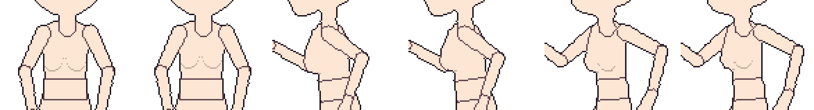
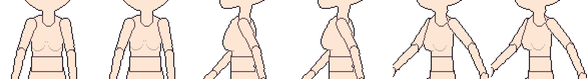

# 계획: 2차 모션 (흔들림)

작성: 2026-09-25 · 상태: **설계** (구현 전, scratchpad 프로토타입으로 시험) · 관련: [가슴 볼륨 파츠](plan-bust-part.md), [프레임별 길이](patchnotes/2026-09-25-frame-hold.md)

## 1. 목적

몸이 움직일 때 **반 박자 늦게 따라오는 흔들림**을 키를 찍지 않아도 자동으로 만든다. 걷기·달리기·점프에서 가슴 볼륨이 살짝 출렁이거나, 앞으로 생길 머리카락·꼬리·스카프 끝이 늦게 따라오는 움직임이다.

지금은 파츠가 스켈레톤을 따라 딱딱하게만 움직인다. 흔들림을 넣으려면 동작마다 키를 직접 찍어야 한다.

## 2. 원칙

| 원칙 | 내용 |
| --- | --- |
| 키는 그대로 | 흔들림은 **프레임을 만들 때 계산해 더한다**. 동작의 키프레임·저장된 포즈는 바뀌지 않는다 |
| 같은 입력 → 같은 결과 | 무작위 없음. 같은 동작·설정이면 언제나 같은 픽셀 |
| 반복 동작은 이음새 없이 | 반복 동작은 3바퀴를 미리 돌려 흔들림이 자리 잡은 뒤, 4번째 바퀴를 쓴다. 마지막 프레임에서 첫 프레임으로 넘어갈 때 튀지 않는다 |
| 픽셀 단위 | 결과를 정수 픽셀(또는 도)로 반올림하고 최대값으로 제한. 도트가 흐려지거나 떨리지 않게 |
| 방향마다 따로 | 정면·측면·반측면은 움직임이 달라서 각각 계산한다 (반전 방향은 원래 방향의 결과를 좌우 반전) |
| 프레임별 길이 반영 | ×2, ×3 프레임은 그만큼 긴 시간으로 계산 |

## 3. 두 가지 방식

| 방식 | 대상 | 움직임 |
| --- | --- | --- |
| **변형형** | 부드러운 덩어리 — 가슴 볼륨 | 파츠 그림의 **윗줄은 고정**하고, 아래로 갈수록 지연만큼 더 밀어 늘이거나 줄인다. 가중치는 (위에서부터 비율)^1.5. 쇄골 쪽은 붙어 있고 아래쪽이 출렁인다 |
| **회전형** | 매달린 것 — 머리카락 끝, 꼬리, 스카프 끝, 귀걸이, 망토 자락 | 관절 기준으로 **추가 회전**. 관절이 움직이는 방향의 반대로 늦게 기울었다가 돌아온다. 자식 파츠가 있으면 마디마다 앞 마디를 늦게 따라간다 (사슬) |

변형형의 이동량 제한은 2x 체형 기준으로 세로 2px·가로 1px, 1x는 절반(1px·0~1px)이다. 회전형은 각도로 제한한다.

## 4. 계산 (스프링)

파츠 관절이 흔들림 없이 있어야 할 캔버스 위치를 **목표**로 둔다. 가상의 점이 이 목표를 **스프링과 감쇠**로 따라가게 한다.

```
가속도 = ω² × (목표 − 위치) − 2ζω × 속도       ω = 2π / 주기
한 프레임 = 16단계로 나눠 계산 (프레임 길이 = 칸 수 / fps)
지연 = 위치 − 목표
```

- 변형형: 지연 × 세기를 그대로 이동량으로 쓴다 (세로·가로 따로 제한).
- 회전형: 지연 중 파츠 방향에 수직인 성분 ÷ 파츠 길이를 각도로 바꾼다 (최대 각도로 제한).

| 설정 | 뜻 | 범위 |
| --- | --- | --- |
| 주기 | 한 번 출렁이는 데 걸리는 프레임 수 (작을수록 탱탱) | 2 ~ 12 프레임 |
| 감쇠 | 흔들림이 잦아드는 빠르기 (0 = 계속 흔들림, 1 = 바로 멈춤) | 0.1 ~ 1 |
| 세기 | 지연에 곱하는 배율 | 0 ~ 2 |
| 최대 | 변형형은 px (세로, 가로는 절반), 회전형은 도 | 0 ~ 6 px / 0 ~ 45° |

### 프리셋

| 프리셋 | 방식 | 주기 | 감쇠 | 세기 | 최대 |
| --- | --- | --- | --- | --- | --- |
| 가슴 볼륨 | 변형형 | 4 | 0.4 | 1 | 2 px (2x) |
| 머리카락 | 회전형 | 3 | 0.3 | 1 | 20° |
| 천·꼬리 | 회전형 | 5 | 0.25 | 1.2 | 35° |

## 5. 프로토타입 (scratchpad, 2x 마네킹 + 가슴 볼륨 중, 변형형 프리셋)

각 GIF는 가슴 부분 확대(×4)이며, 왼쪽부터 정면·좌측면·앞 반측면이다. 방향마다 **끔 | 켬**을 나란히 놓았다.

달리기:



걷기:



계산된 이동량 (세로 px, +는 아래):

| 동작 | 프레임별 |
| --- | --- |
| 걷기 (8프레임) | −1, +1, +1, −1, −1, +1, +1, −1 — 발걸음마다 한 번씩 |
| 달리기 (6프레임) | −2, +2, −1, −2, +2, −1 |
| 점프 (5프레임, 반복 아님) | 0, −2, +2, −2, −2 — 측면·반측면은 가로 ±1도 |

관찰:

- **변형을 외곽선보다 먼저 해야 한다.** 첫 시도는 완성된 프레임에서 가슴 볼륨 픽셀만 옮겼는데, 위로 옮겨질 때 빈틈이 생겨 흰 선이 보였다. 파츠 그림을 먼저 변형하고 합성해서 외곽선을 새로 그리게 바꾸자 깨끗해졌다. 구현도 이 순서를 따른다.
- 처음 설정(주기 3, 감쇠 0.3, 최대 3px)은 달리기에서 매 프레임 +3 ↔ −3으로 튀어 떨림처럼 보였다. 주기 4, 감쇠 0.4, 최대 2px로 낮춘 값을 가슴 볼륨 프리셋으로 했다.
- 점프처럼 반복하지 않는 동작은 마지막 프레임에서도 흔들림이 남는다 (−2). 이 마지막 값을 첫 프레임과 섞을지는 7절에서 정한다.
- 2x에서 1~2px 차이라 확대해야 잘 보인다. 1x에서는 거의 1px 이하라, 1x는 세기를 따로 높이거나 끄는 편이 낫다.

## 6. 적용 위치

| 곳 | 흔들림 |
| --- | --- |
| 애니메이션 미리보기, 시트·GIF·프레임별 PNG 내보내기 | **있음** |
| 편집 캔버스 (키를 만드는 곳) | 기본 **없음** — 키로 잡은 포즈를 그대로 보여야 편집이 쉬움. 보기 메뉴의 "캔버스에 2차 모션 보기"로 켤 수 있음 |
| 프레임 손보기 | 흔들림이 들어간 프레임 위에 칠함 (손본 픽셀은 마지막에 덮음) |
| 장착점 JSON | 흔들리는 파츠의 장착점은 흔들림까지 더한 위치 |
| 내보내기 설정 | 내보내기 메뉴의 "2차 모션 넣기"(기본 켬)로 한 번에 끌 수 있음 (엔진에서 물리를 따로 쓸 때) |

## 7. 정할 것

| 질문 | 제안 |
| --- | --- |
| 가슴 볼륨을 추가할 때 흔들림 기본값 | "가슴 볼륨" 프리셋으로 **켠 채** 추가 (끄려면 파츠 창에서) |
| 반복 아닌 동작의 끝 | 흔들림을 그대로 둠 (다음 동작과 이어지지 않음). 마지막 2프레임만 0으로 줄이는 "끝에서 멈춤" 선택지 |
| 회전형의 대상 | 지금 템플릿에는 머리카락·꼬리 같은 매달린 파츠가 없음. 회전형은 **임의 파츠 추가 기능**과 함께 (별도 계획). 우선은 기존 파츠(손, 머리)에 약하게 쓸 수 있게만 |
| 편집 캔버스 기본 표시 | 없음 (위 6절) |

## 8. 저장·호환

- `skeleton.json`의 파츠에 선택 항목을 쓴다. 흔들림이 있는 파츠만 쓰고, 없으면 파일이 이전과 같다.
  ```json
  "secondary": { "mode": "deform", "period": 4, "damping": 0.4, "strength": 1, "max": 2 }
  ```
- `project.json`에는 내보내기 설정 `"secondaryInExport": false`를 **끈 경우에만** 쓴다.
- 형식 버전은 그대로다. 이전 버전은 이 항목을 무시하고 흔들림 없이 보여 준다.
- 기준 파일(golden) 테스트는 그대로 통과해야 한다 (흔들림 설정이 없는 프로젝트는 결과가 같음).

## 9. 구현 설계

| 위치 | 내용 |
| --- | --- |
| `Core/Animation/SecondaryMotion` (새로) | `SecondarySettings`(방식·주기·감쇠·세기·최대), `Solve(character, clip, direction)` → 프레임마다 파츠별 {이동량 또는 추가 각도}. 스프링 적분, 반복 예열, 프레임별 길이 |
| `Core/Rigging/Part` | `Secondary` (null = 없음) |
| `Core/Rigging/Compositor` | `Compose(..., secondary)` — 변형형은 파츠 그림을 변형해 그리고(외곽선 전), 회전형은 각도를 더해 그림 |
| `Core/Animation/SpriteBaker` | 동작을 구울 때 `Solve` 결과를 프레임마다 넘김. 한 번 계산해 방향별로 저장 (다시 굽기 전까지) |
| `Core/Rigging/CharacterTemplate`, `Project/ProjectFile` | `secondary`·`secondaryInExport` 읽기·쓰기 |
| `Core/Rigging/BustPart` | 추가할 때 "가슴 볼륨" 프리셋 켜기 |
| `App/ViewModels/PartsViewModel`, `Views/PartsView.axaml` | 파츠 창 "흔들림 (2차 모션)": 켜기, 프리셋, 주기·감쇠·세기·최대 (되돌리기 가능) |
| `App` 보기·내보내기 메뉴 | "캔버스에 2차 모션 보기", "2차 모션 넣기" |

## 10. 테스트 계획

- 흔들림이 없는 파츠·프로젝트는 합성 결과가 이전과 같다 (기준 파일).
- 정지한 동작(키가 하나뿐)은 이동량이 모두 0이다.
- 반복 동작에서 마지막 → 첫 프레임의 이동량 차이가 다른 프레임 사이의 차이보다 크지 않다 (이음새).
- 같은 입력이면 두 번 계산해도 같다.
- 최대값을 넘지 않는다. 세기 0이면 0이다.
- 주기가 짧을수록 방향이 바뀌는 횟수가 많다.
- 프레임별 길이를 늘리면 그 프레임 뒤의 값이 달라진다 (시간 반영).
- 변형형: 그림의 윗줄은 제자리이고 아랫줄이 가장 많이 움직인다. 합성 결과에 가슴과의 경계선이 없고 빈틈도 없다.
- 회전형: 추가 각도가 최대 각도를 넘지 않고, 자식 마디가 부모보다 늦게 반응한다.
- 저장 → 불러오기 후 설정이 같다. 내보내기 설정을 끄면 흔들림이 없는 결과가 나온다.

## 11. 작업 순서

1. `SecondaryMotion` 계산 + 테스트 (합성 없이 숫자만)
2. 변형형 합성 + 가슴 볼륨 프리셋, 애니메이션 미리보기·내보내기 반영
3. 파츠 창 설정, 메뉴 두 개, 저장
4. 회전형 (사슬 포함) — 임의 파츠 추가 기능과 함께 진행 권장
5. 앱 확인, 패치노트, 설계 문서 갱신
